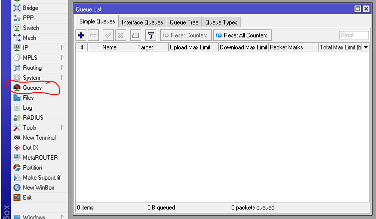
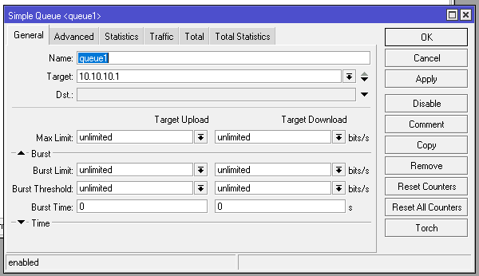
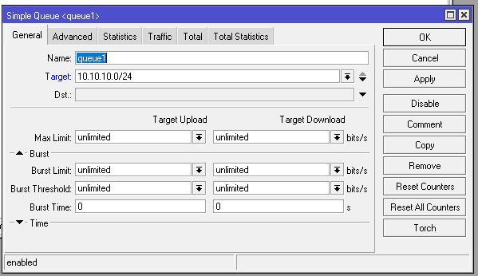
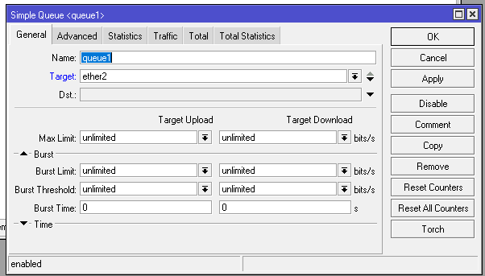
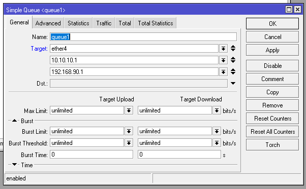
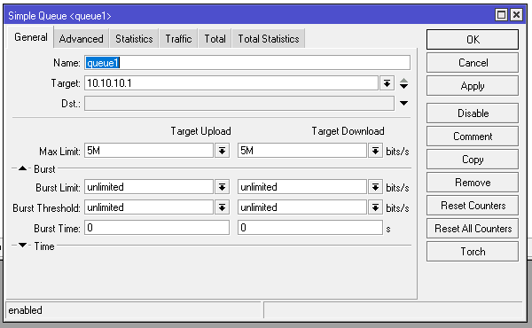
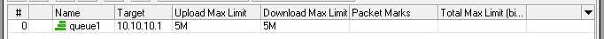
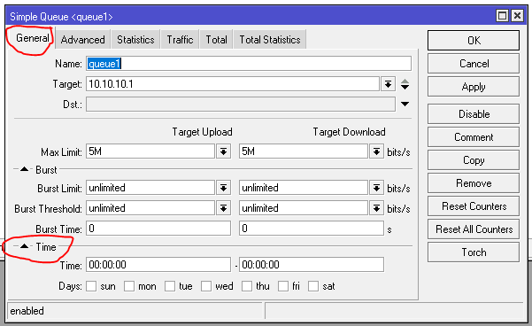

# LAB-27-Simple-queue
tanggal 19 agustus 2025

# SIMPLE QUEUE
Merupakan metode bandwidth management termudah yang ada di Mikrotik. Menu dan konfigurasi yang dilakukan untuk menerapkan simple queue cukup sederhana dan mudah dipahami.

# Konfigurasi Simple queue
1. pilih menu  QUEUES > SIMPLE QUEUE

2. Lalu klik add (+).      
3. bisa di lihat ada beberapa parameter, isi target dengan target yang akan di bandwidth. Cohtohnya saya mentargetkan Laptop saya.

4. Untuk TARGET, itu tidah hanya bisa diisi dengan IP Address saja, tapi bisa diisi dengan subnet yang digunakan untuk melimit suatu kelompok.

5. lalu kita juga bisa mengunakan interface dan nantinya rule akan mentargetkan interface tersebut, misalnya saat laptop terkoneksi ke ether2 atau switch agar terhubung ke banyak perangkat maka limitasi berlaku secara total.

6. Kita juga bisa melimit beberapa IP Address tanpa mengunakan subnet dengan mengunakan arah panah bawah V pada parameter Target.

7. Jika sudah menentukan targetnya, sekarang masukan limitnya dibagian Target Upload & Download pada bagian Max Limit

8. Jika sudah di apply, kita bisa melihat traffic di kolom upload/download avg. rate.

9. Kita juga bisa mengatur kapan simple queue ini aktif, kita bisa lihat di paramater time dibagian tab general.

10. Kemudian klik OK, dan sekarang kita sudah mempunyai sebuah simple queue.
**Pembahasan**
- Packet Marks
Bisa digunakan untuk menggabungkan simple queue dengan firewall mangle, packet marks bisa digunakan untuk melimit TCP traffic tertentu.

**Perbedaan Simple Queue dan Queue Tree**  
1. Simple Queue

Simple Queue mampu melimit Upload, download secara terpisah atau Total(Upload+download) sekaligus dalam satu rule menggunakan tab Total.
Setiap rule pada Simple Queue dapat berdiri sendiri ataupun dapat juga disusun dalam sebuah hierarki dengan mengarahkan Parent ke rule lain.
cukup sederhana dan mudah dipahami.
simple queue khusus untuk bandwidth lokal pak. Targetnya network lokal, dst nya juga network lokal.

2. Queue Tree

Pendefinisian target yang akan dilimit pada Queue Tree tidak dilakukan langsung saat penambahan rule Queue namun dilakukan dengan melakukan marking paket data menggunakan Firewall Mangle.
Setiap service pada jaringan dapat diberikan kecepatan yang berbeda   

# Kesimpulan
Simple Queue pada Mikrotik merupakan metode bandwidth management paling sederhana yang mudah digunakan dan dipahami. Simple Queue cocok untuk manajemen bandwidth dasar dan cepat, sedangkan Queue Tree lebih tepat digunakan untuk kebutuhan kontrol lebih detail.

# Sumber
Youtube - Citraweb - https://www.youtube.com/watch?v=NvlVRX4GOAc 
